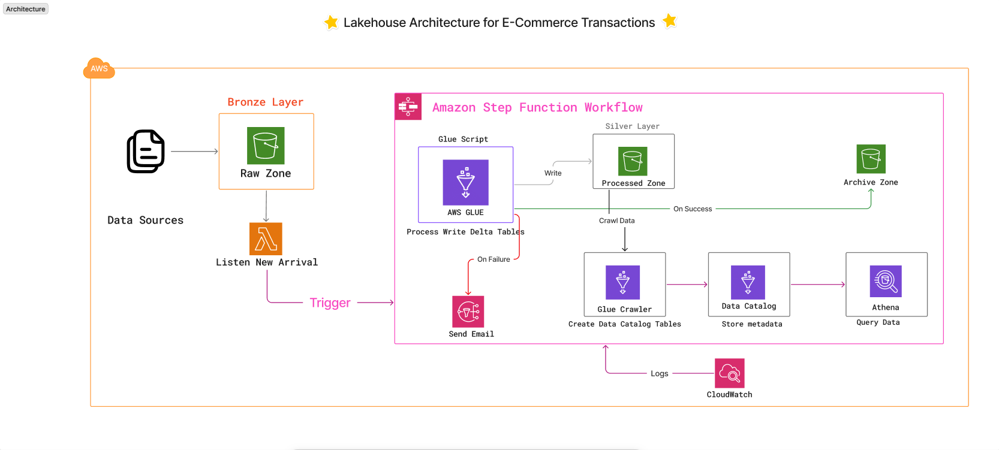
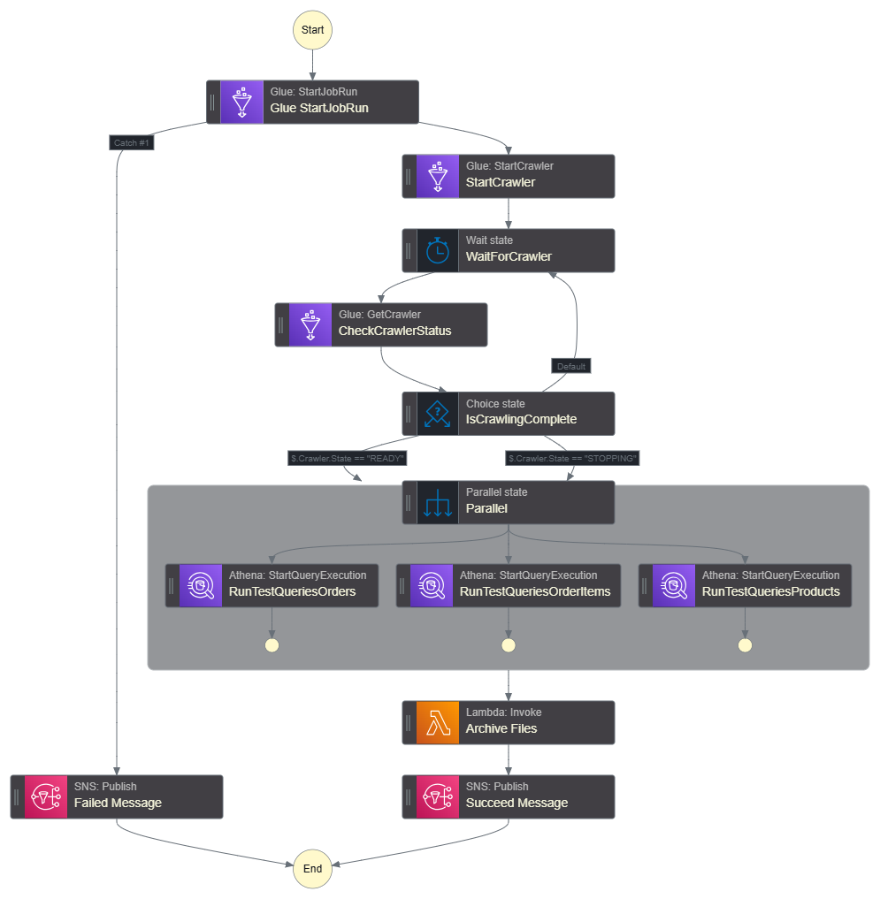
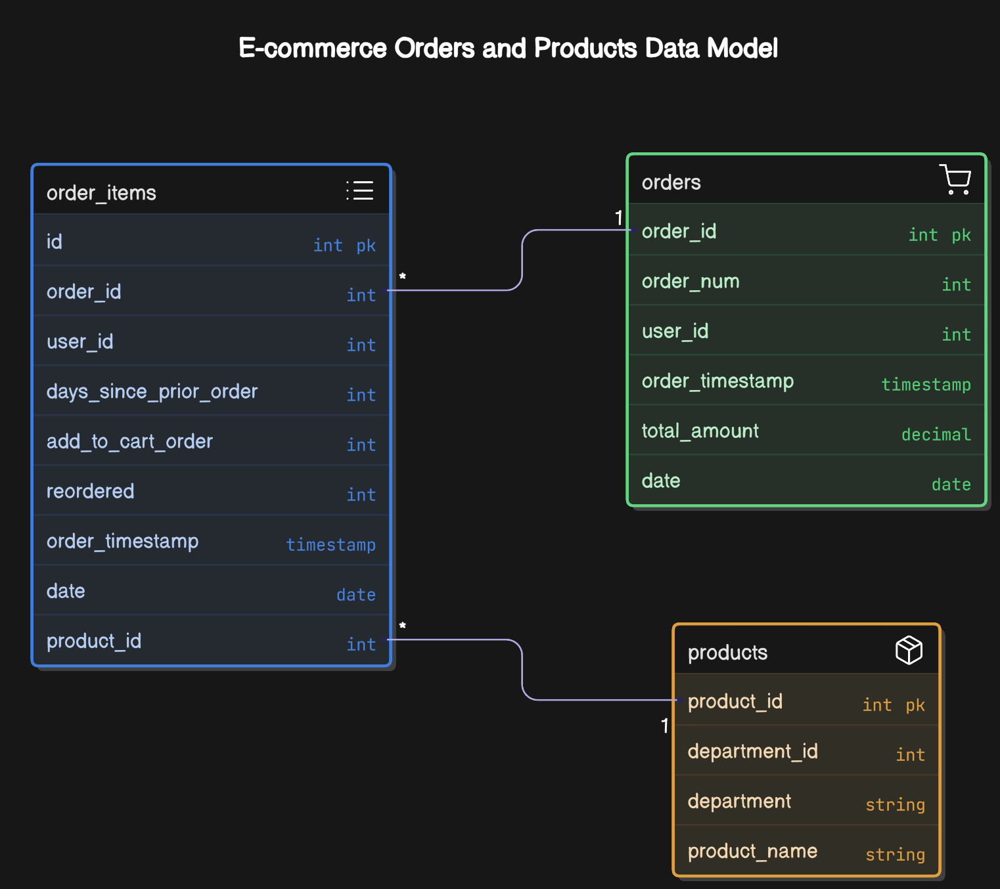

# 🛒 Lakehouse Architecture for E-Commerce Transactions

This project implements a **production-grade Lakehouse architecture** on AWS for processing e-commerce transactional data using PySpark, Delta Lake, and Amazon S3. The architecture supports robust ETL workflows, schema enforcement, data deduplication, and downstream analytics via Amazon Athena.

## 📌 Project Overview

The system ingests raw transactional CSV data from S3, transforms and stores it in optimized Delta tables, and makes it queryable through Athena. Orchestration is handled via AWS Step Functions, and deployment is automated using GitHub Actions.

## 🏗️ Project Structure

<details>
<summary>View Project Structure</summary>

```
├── assets/                # Static assets and resources
│   └── images/           # Architecture and workflow diagrams
├── code/                  # Main implementation code
│   └── step_function_code.json # AWS Step Function definition
├── data/                  # Sample data files
├── docs/                  # Technical Solution Diagram
├── problem/              # Project requirements and specifications
├── scripts/              # Implementation scripts
├── tests/                # Test suite
├── .github/              # GitHub Actions workflows
├── output/               # Generated output file after merge
├── requirements.txt      # Project dependencies
├── pyproject.toml        # Python project configuration
└── .python-version       # Python version specification
```

</details>

## 🏛️ Architecture

<details open>
<summary>View Architecture</summary>


_Figure 1: High-level architecture of the Lakehouse implementation_

</details>

## 🔄 Workflow

<details>
<summary>View Workflow</summary>


_Figure 2: AWS Step Functions workflow diagram_

</details>

## 🧰 Core Technologies

<details>
<summary>View Core Technologies</summary>

| Service               | Purpose                                         |
| --------------------- | ----------------------------------------------- |
| Amazon S3             | Storage for raw and processed data              |
| AWS Glue + Spark      | Distributed ETL jobs and Delta Lake integration |
| Delta Lake            | ACID-compliant storage format on S3             |
| AWS Step Functions    | Orchestrates ETL workflow                       |
| AWS Glue Data Catalog | Metadata layer for Glue and Athena integration  |
| Amazon Athena         | Query engine for processed data                 |
| GitHub Actions        | CI/CD for ETL pipeline                          |

</details>

## 📊 Data Structure

<details>
<summary>View Data Structure</summary>

### Entity Relationship Diagram


_Figure 3: Entity Relationship Diagram showing the relationships between data entities_

### Product Data

- `product_id` (Primary Key)
- `department_id`
- `department`
- `product_name`

### Orders

- `order_num`
- `order_id` (Primary Key)
- `user_id`
- `order_timestamp`
- `total_amount`
- `date`

### Order Items

- `id` (Primary Key)
- `order_id` (Foreign Key)
- `user_id`
- `days_since_prior_order`
- `product_id` (Foreign Key)
- `add_to_cart_order`
- `reordered`
- `order_timestamp`
- `date`

</details>

## 🔄 ETL Pipeline

<details>
<summary>View ETL Pipeline</summary>

1. **Ingestion**

   - Detect new CSV files in S3 raw zone
   - Validate file format and structure
   - Log ingestion events

2. **Transformation**

   - Schema validation and enforcement
   - Data deduplication
   - Partitioning by date
   - Data quality checks

3. **Storage**

   - Store in Delta format in processed zone
   - Update AWS Glue Data Catalog
   - Create/update Athena tables

4. **Orchestration**
   - AWS Step Functions workflow
   - Error handling and retries
   - Success/failure notifications

</details>

## ✅ Data Validation Rules

<details>
<summary>View Data Validation Rules</summary>

- No null values in primary identifiers
- Valid timestamp formats
- Referential integrity across datasets
- Deduplication of records
- Logging of rejected records

</details>

## 🚀 CI/CD Pipeline

CI/CD is managed via **GitHub Actions**, triggered on the `main` branch:

- Python and Java environment setup
- Installation of project dependencies
- Running PySpark integration tests

## 🧪 Testing

<details>
<summary>View Testing Details</summary>

The project includes comprehensive testing of the ETL pipeline:

- **Integration Tests** (`test_glue_etl.py`):

  - Schema validation for orders, order items, and products
  - Data processing and transformation tests
  - Referential integrity checks
  - Data quality validation

- **Core Functions** (`functions.py`):
  - Data validation logic
  - Dataset processing
  - Error handling and logging
  - Data deduplication

The tests ensure:

- Proper schema validation
- Data type correctness
- Referential integrity
- Business rule compliance
- Error handling and logging

</details>

## 🛠️ Setup Instructions

<details>
<summary>View Setup Instructions</summary>

### Prerequisites

- Python 3.x
- pip (Python package installer)
- AWS CLI configured with appropriate credentials
- AWS services:
  - S3
  - Glue
  - Step Functions
  - Athena
  - IAM (for permissions)

### Installation

1. Clone the repository:

   ```bash
   git clone https://github.com/yourusername/lakehouse-ecommerce.git
   cd lakehouse-ecommerce
   ```

2. Install dependencies:

   ```bash
   pip install -r requirements.txt
   ```

3. Configure AWS credentials:

   ```bash
   aws configure
   ```

4. Run tests:
   ```bash
   python -m pytest tests/
   ```

</details>

## 📝 License

This project is licensed under the MIT License - see the [LICENSE](LICENSE) file for details.

## 👥 Contributing

Contributions are welcome! Please feel free to submit a Pull Request.

## 📧 Contact

For any questions or concerns, please open an issue in the repository.
